---

copyright:
  years: 2024
lastupdated: "2024-06-11"

keywords: security services, deployable architecture, IaC

subcollection: security-services

---

{{site.data.keyword.attribute-definition-list}}

# Core Security Services on IBM Cloud
{: deployment-guide}

The Core Security Services Deployable Architecture is a preconfigured set of infrastructure as code (IaC) assets that are deployed and configured based on the recommended best practices. IBM Cloud's core security services are crucial for ensuring robust security and compliance for cloud-based applications and data. Primary goal is to provide framework for secure and compliant IBM Cloud Workloads.

## Objectives and benefits
{: deployment-guide-objectives}

This deployable architecture is designed to showcase a fully automated deployment of IBM Cloud Core Security Services and its dependencies through IBM Cloud Project, providing a flexible and customizable foundation for your own application deployments on IBM Cloud.

By leveraging this architecture, you can accelerate your deployment and tailor it to meet your unique business needs and enterprise goals.

By using this architecture, you can:

* **Establish Trust:** The architecture ensures trust by configuring the IBM Cloud account to align with compliance settings as defined in the [Financial Services](/docs/framework-financial-services?topic=framework-financial-services-about) framework.
* **Ensure Observability:** The architecture provides observability by deploying services such as IBM Log Analysis, IBM Monitoring, IBM Activity Tracker, and log retention through Cloud Object Storage buckets.
* **Implement Security:** The architecture ensures security by deploying IBM Key Protect and IBM Secrets Manager.
* **Achieve Regulatory Compliance:** The architecture ensures regulatory compliance by implementing centralize Key Management, centralize secrets management, and along with IBM Security Compliance Center and Workload Protection (SCC) for secure application lifecycle management.


## Deployment Details
{: deployment-guide-details}

To deploy this architecture, follow these steps.

### 1. Prerequisites
{: deployment-guide-details-prereqs}

Before deploying the deployable architecture, ensure you have:

* Created an API key in the target account with sufficient permissions. The target account is the account that will be hosting the resources deployed by this deployable architecture. See [instructions](/docs/account?topic=account-userapikey&interface=ui) Note the API key, as it will be used later. On evaluation environments, you may simply grant `Administrator` role on `IAM Identity Service`, `All Identity and Access enabled services`, `Activity Tracker Event Routing` and `All Account Management` services. If you need to narrow down further access, for a production environment for instance, the minimum level of permissions is indicated in the [Permission tab](/catalog/7df1e4ca-d54c-4fd0-82ce-3d13247308cd/architecture/deploy-arch-ibm-core-security-svcs-0294f96e-7314-48d1-a710-c08a541b2119#permissions) of the deployable architecture.

* (Optional) Installed the IBM Cloud CLI's Project add-on using the `ibmcloud plugin install project` command. More information is available [here](https://cloud.ibm.com/docs/cli?topic=cli-projects-cli).

Ensure that you are familiar with the "Important Deployment Considerations" located at the bottom of this document.

### 2. Deploy the Stack in a New Project from Catalog
{: deployment-guide-details-deploy}

* Locate the Core Security Services [tile](/catalog/7df1e4ca-d54c-4fd0-82ce-3d13247308cd/architecture/deploy-arch-ibm-core-security-svcs-0294f96e-7314-48d1-a710-c08a541b2119#about) for the Deployable Architecture in the IBM Cloud Catalog. It will load the Core Security Services Panel. On this panel, you can review the Product Version, Variation, Architecture overview, Permissions, Security & Compliance, Help and Pricing.
* Afrer, Click the "Add to project" button.

    

* Select **Create new** and enter the following details:
   - Name and Description (e.g., "Core Security Services")
   - Region and Resource Group for the project. e.g. for evaluation purposes, you may select the region the closest to you, and the Default resource group. For more insights on the recommended production topology, refer to the Enterprise account architecture Central administration account [white paper](/docs/enterprise-account-architecture?topic=enterprise-account-architecture-admin-hub-account).
   - Configuration Name (name of the automation in the project, e.g., "ccs_cfg", "ccs_dev" or "ccs_prod", ideally matching the deployment target, but this can be any name)

        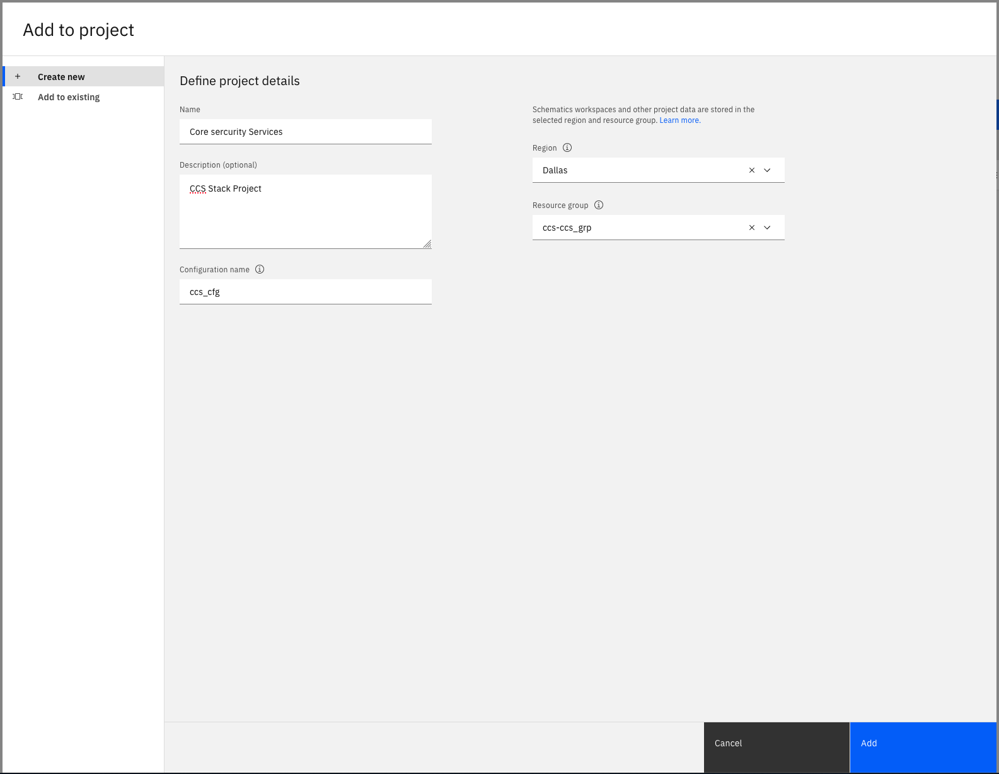

* Click the **Add** button (or **Create** if this is the first project in the account) at the bottom right of the modal popup to complete.

### 3. Set the Input Configuration for the Stack
{: deployment-guide-details-input}

After completing `Step 2 - Deploy the Stack in a New Project from Catalog`, you are directed to a page allowing you to enter the configuration for you deployment:
* Under Security -> Authentication, enter the API Key from the prereqs in the `api_key` field.
  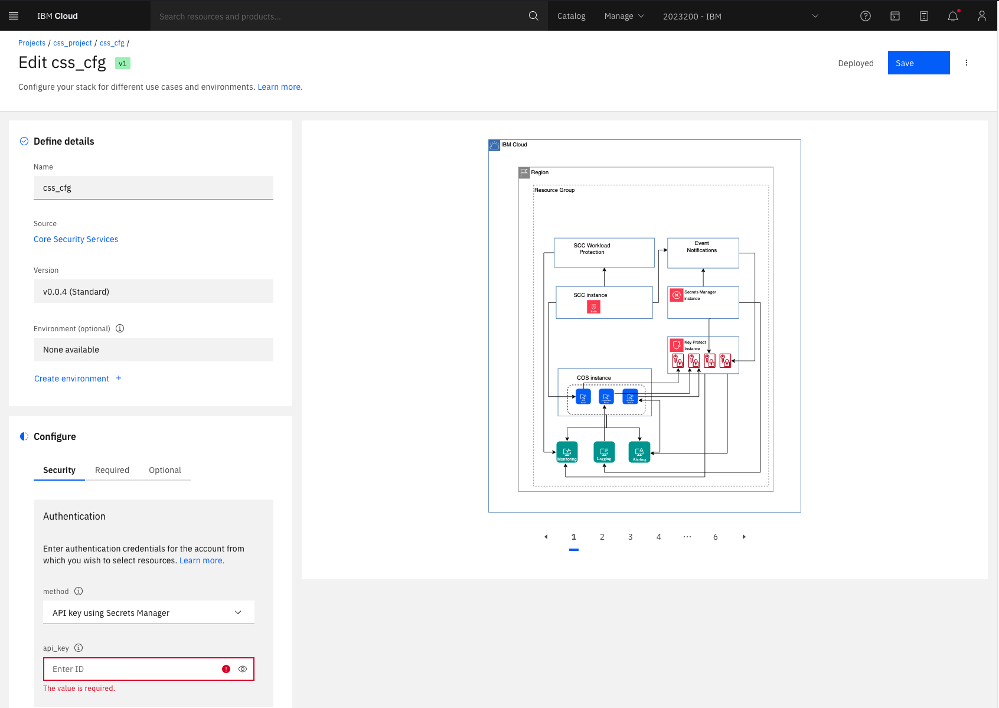
* Under Required, input a prefix. This prefix will be appended to the name of most resources created by automation, ensuring uniqueness and avoiding clashes when provisioning names in the same account. **Note:** Prefix does not contain undersocre.
* 
* Select the region and provide a resource group name where you would like the resources to be created. 
* Under Optional, input the secrets manager and security services center's plan field. While not necessary for deploying Cloud resources, it is recommended and required to enable the building and deployment of the sample app.

You may explore the other available inputs, such as the region and resource group name (under required tab), leave them as is, or modify them as needed.

Once ready, click the "Save" button at the top of the screen. After validating the input values from the step above, the buttin will change to "View stack configurations -->"

### 4. Deploy the Architecture
{: deployment-guide-details-deploy-architecture}

Navigate to the project deployment view by clicking the project name in the breadcrumb menu.

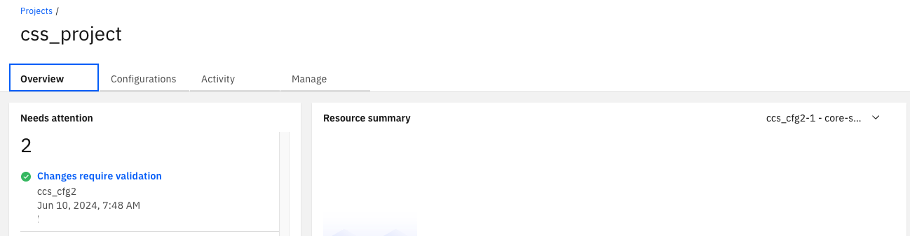


You should be directed to a screen looking like:

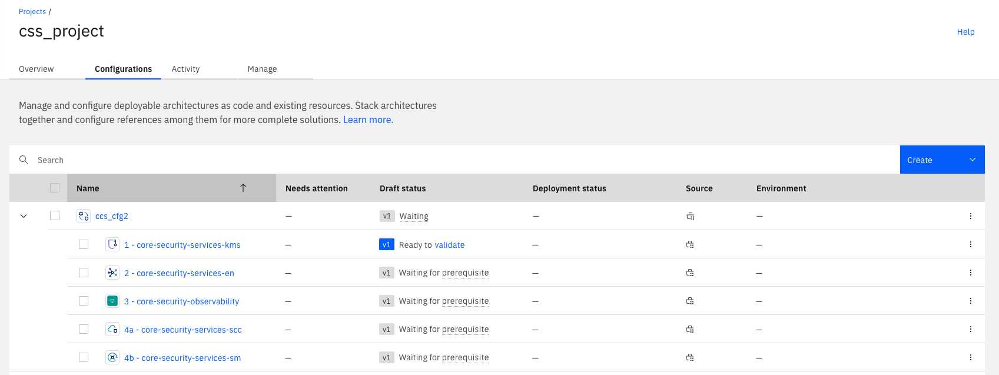

Note: in some rare occurences, the first member of the stack may not be marked as "Ready to validate". Refreshing the page in your browser window should solve this problem.

#### Deployment through the UI
{: deployment-guide-details-deploy-architecture-ui}

1. Click on validate

    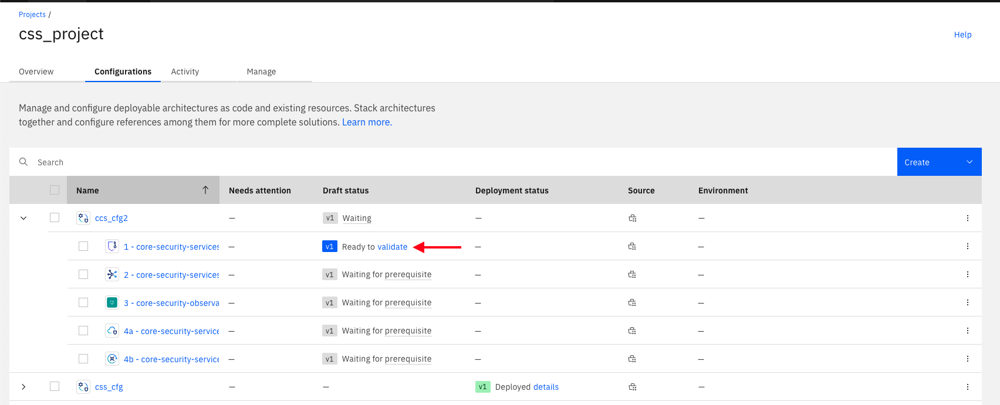

2. Wait for validation

    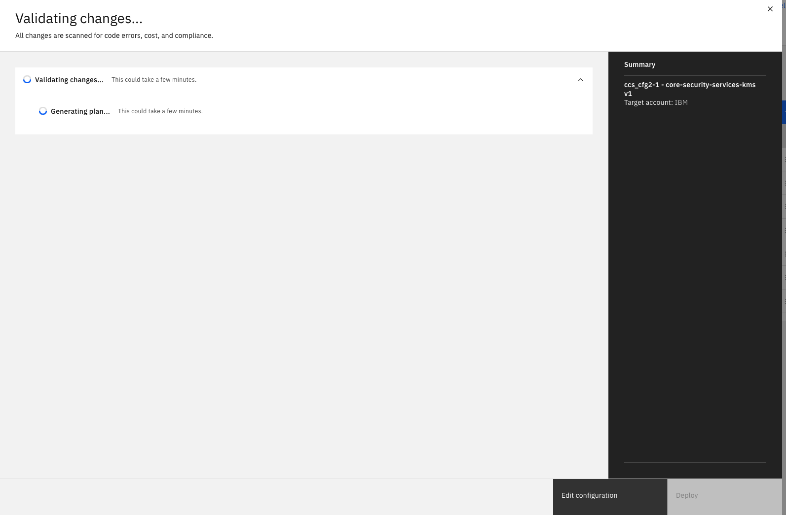

3. Approve and click the deploy button

    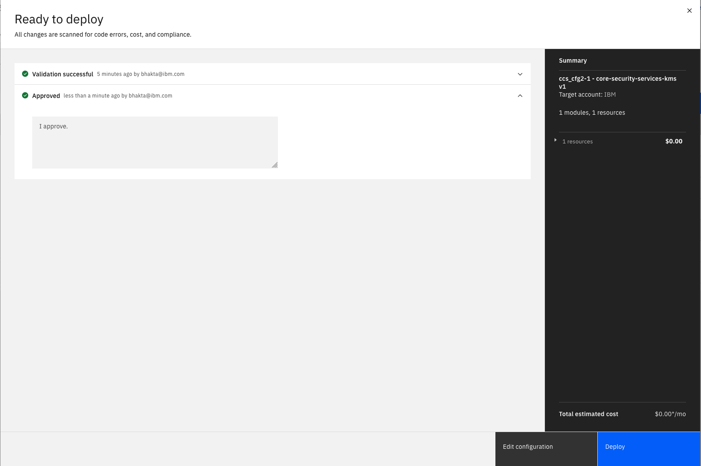

4. Wait for deployment

5. Repeat step 1 for the next configuration in the architecture. Note that as you progress in deploying the initial kms configuration, you will be given the option to validate and deploy multiple configuration in parallel. 

    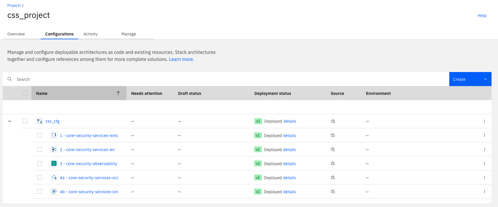


### 5. Post deployment steps
{: deployment-guide-details-deploy-architecture-more-steps}

At this point, the infrastructure platform services have been successfully deployed in the target account.

#### Viewing Core Security Services Resources
{: deployment-guide-details-deploy-architecture-more-steps-view}

To view deployment of the core security services related resources, follow these steps:
1. **Access the Resource list View**: Navigate to the Resource List Icon on [Left Navigation](https://cloud.ibm.com/resources) in the target account.

2. **Select the Resource Group and Region**: Choose the resource group and region where the infrastructure was deployed. The resource group name is based on the prefix and resource_group_name inputs of the deployable architecture.

    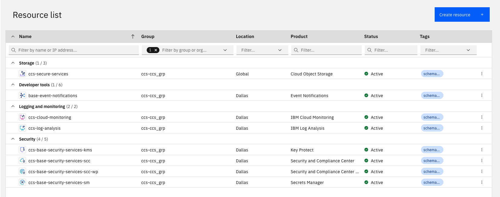


### 6. Important Deployment Considerations
{: deployment-guide-details-deploy-architecture-considerations}

#### API Key Requirements
{: deployment-guide-details-deploy-architecture-considerations-api-key}

The deployable architecture can only be deployed with an API Key associated with a user. It is not compatible with API Keys associated with a serviceId. Additionally, it cannot be deployed using the Project trusted profile support.

#### Known UI Issue: "Unable to validate your configuration"
{: deployment-guide-details-deploy-architecture-considerations-unable-validate}

After approving the configuration, you may encounter an error message stating "Unable to validate your configuration". This is a known UI issue that can be resolved by simply **refreshing your browser window**. This will allow you to continue with the deployment process.

#### Known Issue: "Observability configuration fails"
{: deployment-guide-details-deploy-architecture-considerations-observability-fails}

* Key ring must have be between 2-100 characters with matching regular expression `^[a-zA-Z0-0-]*$`. Ensure the prefix used does not contain the invalid characters. Update the prefix and revalidate the configuration. 

* Error: [ERROR] Error when creating resource instance: Please contact the Service Provider for this error. [500, Internal Server Error] Sysdig provision request return code: 500. Ensure the API Key used as "Editor" or "Administrator" permission for the Activity Tracker Event Routing service. 

#### Notification of New Configuration Versions ("Needs Attention")
{: deployment-guide-details-deploy-architecture-considerations-new-config-versions}

You may see notifications in IBM Cloud Project indicating that one or more configurations in the stack have new versions available. You can safely ignore these messages at this point, as they will not prevent you from deploying the stack. No specific action is required from you.

Please note that these notifications are expected, as we are rapidly iterating on the development of the underlying components. As new stack versions become available, the versions of the underlying components will also be updated accordingly.

#### Limitations with the Trial Secret Manager Offering
{: deployment-guide-details-deploy-architecture-considerations-sm-limitations}

The automation is configured to deploy a Trial version of Secret Manager by default to minimize costs. However, the Trial version has some limitations. If you want to avoid these limitations, you can opt to deploy a standard (paid) instance of Secret Manager under the **Optional settings** of the stack.

Here are the limitations of the Trial version:
* **Account limitation**: Only one Trial instance of Secret Manager can be deployed at a time in a given account.
* **Deployment error**: You will encounter an error in the Secret Manager deployment step if there is already a Trial instance deployed in the same account.
* **Re-deployment failure**: If the automation provisions a Trial version of Secrets Manager, and is un-deployed and then re-deployed again with the Trial version in the same account, the "2b - Security Service - Secret Manager" deployment will fail. This is because you can only have one Trial version of Secrets Manager in an account, and even after deletion, the prior Trial version of Secrets Manager needs to be removed from the "reclamation" state as well.

**What are reclamations?**
In IBM Cloud, when you delete a resource, it doesn't immediately disappear. Instead, it enters a "reclamation" state, where it remains for a short period of time (usually 7 days) before being permanently deleted. During this time, you can still recover the resource if needed.

To resolve the re-deployment failure, you will need to delete the Secret Manager service from the reclamation state by running the following commands:
```
ibmcloud resource reclamations #  lists all the resources in reclamation state, get the reclamation ID of the secret manager service
ibmcloud resource reclamation-delete <reclamation-id>
```

## Customization options
{: deployment-guide-customizations}

There are numerous customization possibilities available out of the box. This section explores some common scenarios, but is not exhaustive.

### Editing Individual Configurations
{: deployment-guide-customizations-editing-config}

Each configuration in the deployed stack surfaces a large number of input parameters. You can directly edit each parameter to tailor your deployment by selecting the **Edit** option in the menu for the corresponding configuration on the right-hand side.

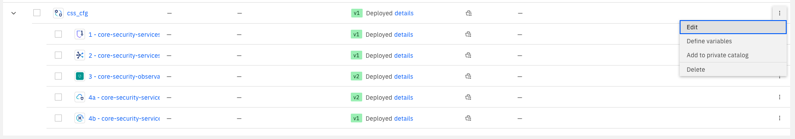

This approach enables you to:
- Use existing instances of Key Protect, Secrets Manager, etcc
- Deploy to an existing resource group
- Configure endpoint type private/publix
- Reuse existing key protect keys
- Tuning the parameter of individual services
- ...

### Removing Configurations from the Stack
{: deployment-guide-customizations-removing-config}

It is not recommened to remove and component, howeer you can remove any configuration from the stack, provided there is no direct dependency in later configurations, by selecting the **Remove from Stack** option in the right-hand side menu for the corresponding configuration.

This applies to the following configurations:
- Observability
- Security and Control Center
- Secrets Manager

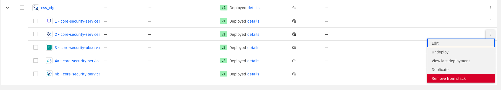

### Managing Stack-Level Inputs and Outputs
{: deployment-guide-customizations-managing-inputs-outputs}

You can add or remove inputs and outputs surfaced at the stack level by following these steps:
1. Select the stack configuration

    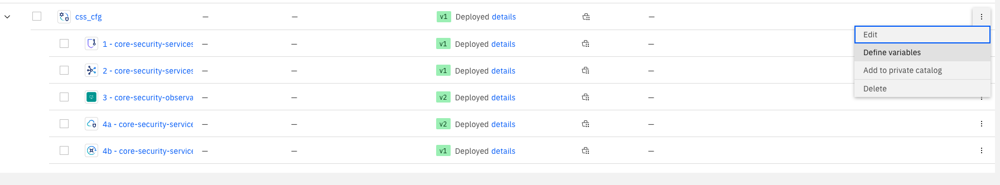
1. You are presented with a screen allowing you to promote any of the configuration inputs or outputs at the stack level

    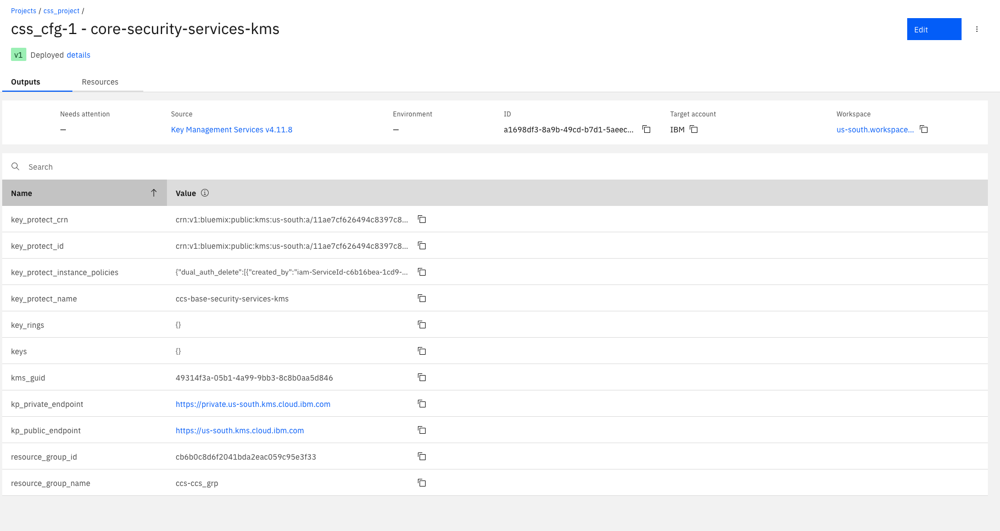

### Sharing Modified Stacks through a Private IBM Cloud Catalog
{: deployment-guide-customizations-sharing-stacks}

Once you have made modifications to your stack in Project, you can share it with others through a private IBM Cloud Catalog. To do so, follow these steps:
1. Deploy the stack at least once: You need to deploy the stack first to allow importing the stack definition to a private catalog.
2. Select the "Add to private catalog" option in the menu located on the stack configuration.

This will allow you to share your modified stack with others through a private IBM Cloud Catalog.

## Undeploying the Stack, and all associated Infrastructure Resources
{: deployment-guide-undeploy}

### Undeploying Infrastructure
{: deployment-guide-undeploy-infrastructure}

To undeploy the infrastructure created by the automation, complete the following steps:

#### 1. Undeploy Configurations in the Project
{: deployment-guide-undeploy-configs}

Undeploy each configuration in the project, one by one, via UI, starting from the "4b - core-security-services-sm" and working your way up in the stack up to, and inclusive of "1 - core-security-services-kms". Wait for full undeployment of a configuration before starting to undeploy the next configuration up in the stack.

#### 3. Delete Reclamation Claims
{: deployment-guide-undeploy-reclamation}

Before undeploying the "1 - core-security-services-kms", you will need to manually delete the reclamation claims for the resources deleted from the previous steps. Reclamation allows you to restore deleted resources for up to one week. However, any reclamation that is still active prevents from deleting the resource group managed by the "1 - core-security-services-kms":
* Log in to the target IBM Cloud account with the CLI
* Run `ibmcloud resource reclamations` to view the full list of reclamation. You may identify the exact reclamations to delete as they are planned to be deleted in one week after the date for which the resource was deleted.
* For each reclamation, execute `ibmcloud resource reclamation-delete <reclamation-id>`. The reclamation-id is the id provided in the results from ibmcloud resource reclamations listing.
* Run `ibmcloud resource reclamations` again to ensure the reclamations have been fully deleted

More details are available [here](/docs/account?topic=account-resource-reclamation&interface=cli).

#### 4. Undeploy "1 - core-security-services-kms"
{: deployment-guide-undeploy-kms}

You may now undeploy "11 - core-security-services-kmse" in the project.

#### 5. Delete Project
{: deployment-guide-undeploy-project}

Once all configurations are undeployed, you may delete the project. You may also delete the project first to delete all configurations if you do not want to delete stack one by one. 
